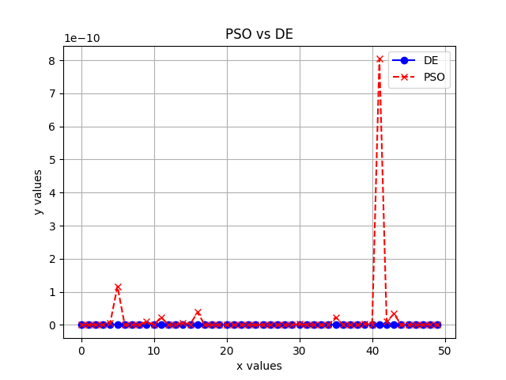

# Informe del trabajo de algoritmia de Modelos de Optimización

Daniel Toledo Martínez - C311

## Resumen

En el presente trabajo se presenta una solución del problema de **mishra**, utilizando el método **Differential Evolution**, así como una breve explicación de por qué algunos de los métodos estudiados en clase no pueden ser utilizados para resolver el problema.

## Métodos no aceptados

La función de mishra en cuestión no puede ser resuelta por los siguientes métodos:

1. Método de descenso del gradiente
2. Método de Newton
3. Método de Quasi-Newton
4. Método BFGS

#### Método de descenso del gradiente

Este método no puede ser utilizado debido a que el problema en cuestión es multilineal, por lo que el método del gradiente es propenso a quedar atrapado en los óptimos locales. El éxito del método del gradiente dependería por completo de la elección del punto inicial.

#### Método de Newton

El método de Newton no puede ser utilizado porque depende tanto del gradiente como de la matriz Hessiana. Por ser no escalable haría que calcular la matriz Hessiana fuera difícil y propenso a errores. Además como depende del gradiente sufre los mismos problemas que el método anterior.

#### Método de Quasi-Newton

Este método sufre los mismos problemas que el método de Newton, ya que a pesar de la construcción aproximada de la matriz Hessiana depende del gradiente de la función, y por tanto es propensa a quedar atrapada en óptimos locales.

#### Método BFGS

Este método puede ser efectivo para problemas diferenciables, y no requiere computar la Hessiana como miembro de la familia de los Quasi-Newton, sin embargo puede quedar atrapado en mínimos locales por ser el problema multimodal, aunque si podría utilizarse si tuviéramos una buena aproximación de en que punto del espacio se encuentra el óptimo global.

## Métodos aceptados

#### Differential Evolution

El método con el que se pudo dar solución al problema fue el método **Differential Evolution** de **scipy**, el cual es un método estocástico basado en poblaciones. Mientras recorre la población el algoritmo muta cada una de las soluciones candidatas, mezclandolas con otras soluciones candidatas para crear un candidato de prueba. La estrategia utilizada por defecto es *"***best1bin***"*. En esta estrategia se seleccionan de manera aleatoria dos miembros de la población y su diferencia se utiliza para mutar el mejor miembro. Luego se construye el vector $b' = x_0 + mutation * (x_{r_0} - x_{r_1})$. Luego se construye un vector de prueba, empezando por un $i$-ésimo valor elegido aleatoriamente, el vector se llena con valores de $b'$ o del candidato original. La elección se realiza utilizando una distribución binomial, se genera un número aleatorio en $[0, 1)$. Si el valor es menor que la constante de recombinación entonces se utiliza el de $b'$, en caso contrario se selecciona del candidato original. El parámetro final siempre se obtiene de $b'$. Una vez se construye el candidato se realiza una revisión para determinar si mejora la solución, si el candidato es mejor que el original, toma su lugar, y si es mejor que el candidato a solución actual, también lo reemplaza.

Se seleccionó este método debido a que el problema de **mishra** en cuestión es un problema no convexo con múltiples óptimos locales, por lo que debemos desechar las técnicas que puedan quedar atrapadas en un óptimo local. Este algoritmo explora el espacio de búsqueda completo, por lo que aumenta las probabilidades de encontrar el óptimo global. El algoritmo no requiere que la función sea diferenciable o se pueda calcular un gradiente. Al evitar la dependencia del gradiente **Differential Evolution** es más robusto en problemas con funciones irregulares. **Differential Evolution** puede manejar restricciones y dominios complejos de manera eficiente. En el caso de  **Mishra**, donde la función tiene múltiples términos de alta complejidad, el algoritmo puede ajustarse bien para trabajar dentro de estos dominios sin requerir simplificaciones o transformaciones problemáticas.

#### Particle Swarm Optimization (PSO)

**Particle Swarm Optimization** es un método basado en poblaciones, inspirado en el comportamiento social de las bandadas de pájaros o los bancos de peces. Su funcionamiento consiste en inicializar un grupo de posibles soluciones (partículas) en el espacio de búsqueda, cada una de las partículas posee una posición en el espacio que representa una solución candidata y la dirección y velocidad con que se mueven, la posición se evalúa en la función objetivo para determinar su calidad. Cada partícula recuerda su mejor posición y el enjambre almacena la mejor posición global. Durante cada iteración la velocidad de las partículas se actauliza teniendo en cuenta la velocidad actual, la diferencia entre la posición actual y el mejor resultado local, y la diferencia entre la posición actual y el máximo global. La partícula se mueve por el espacio utilizando la nueva velocidad calculada. El algoritmo termina cuando se cumple un criterio de detención, como un número máximo de iteraciones o cuando las partículas convergen a una solución óptima.

Este método también puede ser utilizado para resolver el problema, aunque no da tan buenos resultados como el anteriormente explicado, debido a que puede estancarse en los mínimos locales, y su parámetro puede verse limitado por la selección de los hiperparámetros. A pesar de esto el método posee un buen balance entre exploración y explotación, y converge de manera rápida, pero no siempre encuentra los mejores resultados.

## Anexos

Gráfica con la comparación de los resultados obtenidos con los métodos Particle Swarm Optimization(PSO) y Differential Evolution(DE)

